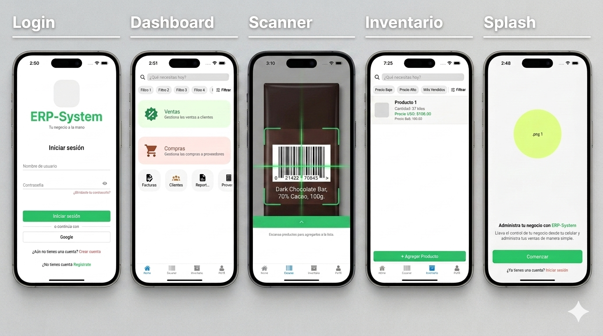

# ERP-System · Mobile ERP for SMBs

> React Native · Expo SDK 54 · SQLite · TypeScript · Offline-First

A production-grade mobile ERP built for small and mid-size businesses — handling inventory, sales with FIFO costing, barcode scanning, and supplier purchases. Designed to work fully offline with local SQLite persistence.

---

## 📌 Historia del Proyecto

Este proyecto es la evolución de un prototipo construido en 2022-2023 mientras exploraba la arquitectura de aplicaciones móviles offline-first.

- **2022-2023:** Prototipo inicial → [ERPMobile](https://github.com/rennyluzardo/ERPMobile)
- **2025 – presente:** Reescritura completa con stack moderno y arquitectura escalable

---

## ✦ Funcionalidades Core

| Módulo | Descripción |
|---|---|
| 🔐 Autenticación | Login, registro y recuperación de contraseña con tokens en `expo-secure-store` |
| 📦 Inventario | CRUD completo de productos, control de stock y categorización |
| 💰 Ventas | Creación de pedidos con cálculo automático FIFO y soporte multi-venta |
| 📷 Barcode Scanner | Escaneo con cámara, feedback sonoro y agregación automática a ventas |
| 🛒 Compras | Gestión de órdenes de compra y relaciones con proveedores |

---

## 📱 Screenshots

<p align="center">
  
</p>

---

## 🏗️ Arquitectura

### Stack Tecnológico

**Core**
- React Native 0.81 + Expo SDK 54
- TypeScript (strict mode)
- Expo Router 6 — file-based routing

**Datos**
- `expo-sqlite` 16 — persistencia local SQLite
- `expo-secure-store` — almacenamiento cifrado de credenciales

**UI**
- React Native Paper 5 — componentes Material Design
- React Native Reanimated 4 — animaciones
- Expo Vector Icons

**Testing**
- Jest 29 + jest-expo

---

### Estructura de Carpetas

```
app/
├── (auth)/                   # Flujo de autenticación (file-based routing)
│   ├── loginScreen.tsx
│   ├── registerScreen.tsx
│   └── forgotPasswordScreen.tsx
├── (tabs)/                   # Navegación principal con tab layout
│   ├── index.tsx             # Dashboard
│   ├── scannerScreen.tsx
│   ├── inventoryScreen.tsx
│   └── profileScreen.tsx
└── _layout.tsx

components/                   # Componentes reutilizables
├── AuthForm.tsx
├── ProductScanner.tsx
└── ...

database/                     # Capa de datos aislada
├── index.ts                  # Inicialización y migraciones SQLite
├── queries.ts                # Queries parametrizadas (sin string interpolation)
└── models/                   # Tipos e interfaces de entidades

constants/
├── Colors.ts
├── Fonts.ts
└── Sounds.ts

utils/
├── auth.ts
└── database.ts
```

---

## 🧠 Decisiones de Arquitectura

### ¿Por qué SQLite local y no una API remota?

El caso de uso target son negocios con conectividad intermitente (almacenes, tiendas físicas). SQLite garantiza que **todas las operaciones críticas funcionen offline**: crear ventas, escanear productos, actualizar stock. La sincronización con un backend es una capa futura, no un requisito bloqueante.

### ¿Por qué FIFO para el costeo de ventas?

FIFO (First In, First Out) es el estándar contable más adoptado en LATAM para PYMEs. Garantiza que el costo de los productos vendidos refleje el precio real de adquisición en orden cronológico, lo cual es crítico para márgenes precisos en contextos inflacionarios.

### ¿Por qué Expo Router sobre React Navigation puro?

El routing file-based de Expo Router alinea la estructura del proyecto con las rutas de navegación, reduciendo la brecha entre lo que ves en el file system y lo que el usuario navega. Para un ERP con múltiples módulos, esto reduce la deuda cognitiva al crecer el proyecto.

### ¿Por qué `expo-secure-store` para credenciales?

`AsyncStorage` persiste en texto plano. En un contexto empresarial donde el dispositivo puede ser compartido o perdido, almacenar tokens de autenticación en el Keychain (iOS) / Keystore (Android) via `expo-secure-store` es la decisión correcta, no un nice-to-have.

### Queries parametrizadas como regla absoluta

Toda interacción con SQLite usa queries parametrizadas. String interpolation en SQL está prohibida en la capa de datos para eliminar riesgo de SQL injection, incluso en contexto local.

---

## 🗃️ Esquema de Base de Datos

```sql
users           — autenticación y perfil
inventory_items — productos, stock y categorías  
sales           — cabecera de pedidos de venta
sale_items      — líneas de venta con costeo FIFO
purchases       — órdenes de compra a proveedores
```

---

## 🚀 Instalación y Desarrollo

### Prerrequisitos

- Node.js 18+
- Expo CLI (`npm install -g expo-cli`)
- Expo Go en dispositivo físico, o emulador iOS/Android

### Setup

```bash
git clone https://github.com/rennyluzardo/erp-system
cd erp-system
npm install
npx expo start
```

### Ejecutar en dispositivo

```bash
# iOS
npx expo run:ios

# Android
npx expo run:android
```

### Build de producción (EAS)

```bash
# Instalar EAS CLI
npm install -g eas-cli

# Build Android
eas build --platform android

# Build iOS
eas build --platform ios
```

---

## 🧪 Testing

```bash
npm test
```

---

## 📄 Licencia

MIT © [Renny Luzardo](https://github.com/rennyluzardo)
